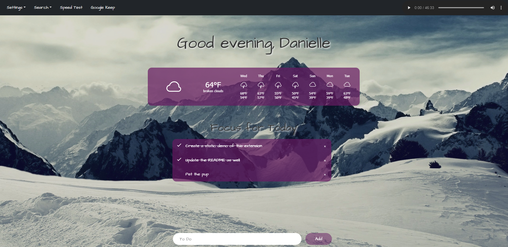

<h1 align="center">Welcome to Dashboard-Chrome-Extension!</h1>

	
  

> HarvardX's CS50 - Introduction to Computer Science - FINAL PROJECT: New Tab Extension for Google Chrome

> This is my final project I created for the online CS50 class offered by Harvard through the [EdX website](https://www.edx.org/). This extension features: greeting the user (by name, once added in settings), a persistent To-Do list, a weather widget, a music player, external links, and a Google or a DuckDuckGo internet search. This project uses the Starter Template from Bootstrap 5.0.

## Static Demo

## Author

👤 **Danielle Andrews**

- Github: [@DrAcula27](https://github.com/DrAcula27)
- LinkedIn: [@daniellerandrews](https://linkedin.com/in/daniellerandrews)

## Usage

To use this extension:

1. Clone this repo to your computer, and note where you save it.
1. Go to `chrome://extensions/` in Chrome and toggle Developer Mode (in the upper-right corner) to on.
1. Refresh the page.
1. Click on the `Load unpacked` button near the upper-left corner.
1. Browse to the folder where you cloned this repo.
1. Click the `Select folder` button to upload it to Chrome.
1. Open a new tab!

## Future Work

- Change settings button to settings wheel?
- Add background images to cycle through.
- Add ability to switch between music files.

## Attributions

- Inspiration for this extension is from Sara Wegman's extension, Compliment Dash, and her [tutorial](https://medium.com/javascript-in-plain-english/https-medium-com-javascript-in-plain-english-how-to-build-a-simple-chrome-extension-in-vanilla-javascript-e52b2994aeeb).
- Music used is the Elder Scrolls III Morrowind soundtrack.
- Background image was found [here](https://wallpaperaccess.com/snow-mountain).
- Weather widget is from [weatherwidget](weatherwidget.io).

## Show Your Support

Give a ⭐️ if you liked this project!
